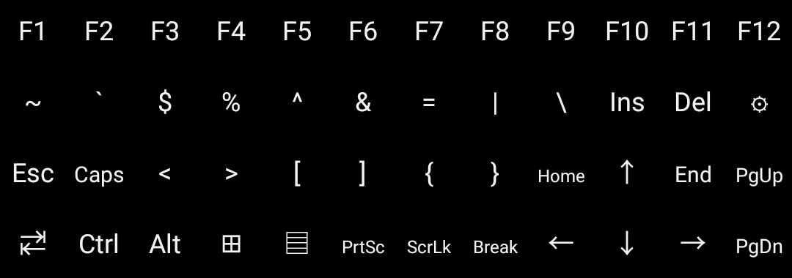

# BlackBerry Key2 Key Extension

## Overview

BlackBerry Key2 Key Extension is an IME for BlackBerry Key2 to input additional keys missing on the physical keyboard.

The BlackBerry Key2 keyboard and its built-in IME is designed for business usage, and lacks some essential keys on the desktop computer keyboard, which, makes it inconvenient for developers who make extensive use of [Termux](https://github.com/termux/termux-app) and [Microsoft RDP](https://play.google.com/store/apps/details?id=com.microsoft.rdc.android&hl=en_US).

[Hacker's Keyboard](https://github.com/klausw/hackerskeyboard) provides these missing keys, but it is not designed for the BlackBerry Key2 keyboard, and is not very space-efficient.

Termux provides [extra keys row](https://wiki.termux.com/wiki/Touch_Keyboard) functionality which is a good fit for the BlackBerry Key2 keyboard, but only inside Termux itself.

Combining all these ideas, I finally decided to create an IME specifically designed for BlackBerry Key2 and contains only the missing keys.

## Functionality

All keys missing from a 84-key keyboard are added back.

Holding on a key will trigger its keypress multiple times.

Modifiers functions as slow keys, that you can release it and press another normal key to trigger it. Multiple modifiers can be pressed one by one. To trigger a single modifier keypress event, press it twice. To trigger a long shortcut, such as Ctrl+K,D, you'll have to pressing the modifier and press other keys, like on a desktop keyboard.

Sym key is used as a switch for the virtual keyboard. You can force open or close the virtual keyboard at any time without input focus.

The option icon is not implemented now.
